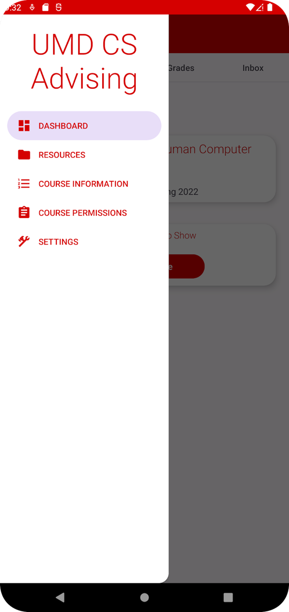
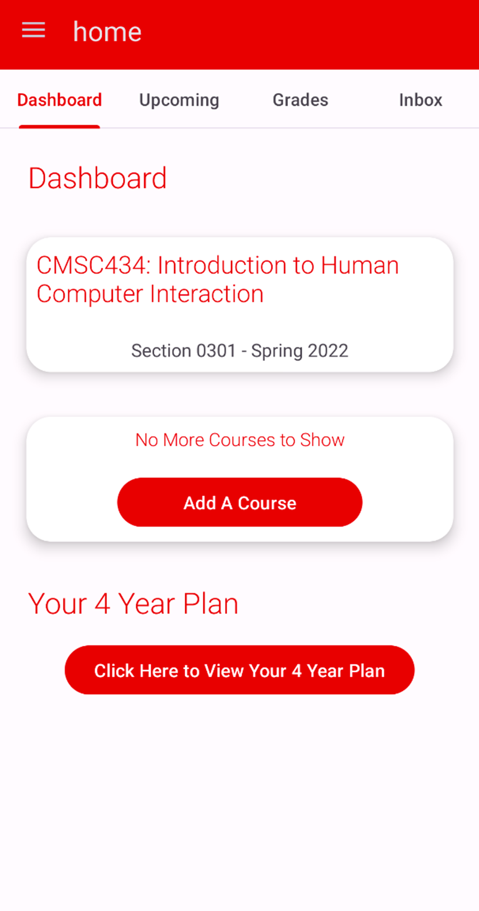
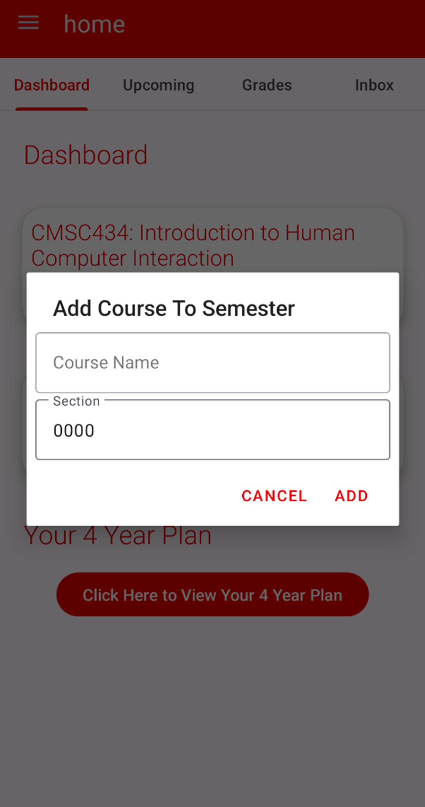
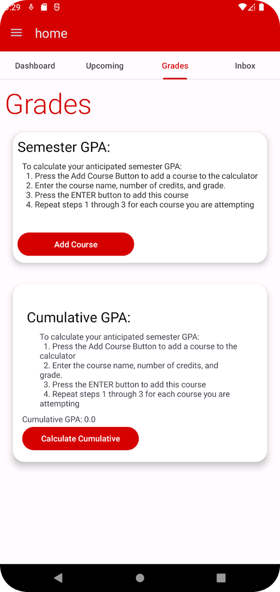
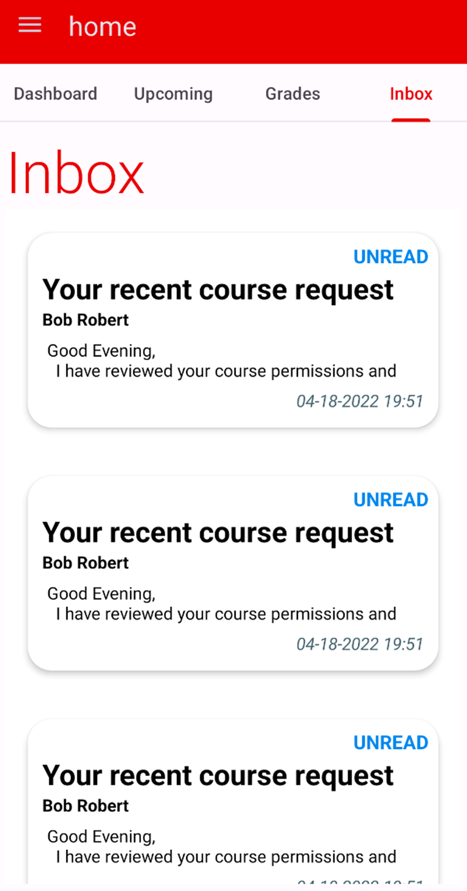

# Computer Science Advising App
This app is supposed to help CS undergrad students (or users interested in the minor/major) have faster access to the information on the UMD CS Advising webpages that are frequently visited, such as the list of cs degree requirements, or upcoming advising events. The app also provides handy tools such as a GPA calculator, a course request form, and more.

## Nav
I organized the many different parts of the app by implementing a drawer navigation for the top layer, and tabbed navigation for each subpart of the app. The screens are organized by their intended tasks. 

### Home Drawer
The App is made of four parts that can be accessed via the drawer navigarion that is present throughout the whole app. The five items in the drawer all take the user to a different part of the app.

### Tabs

  The following is an image of a user's Dashboard which is located inside the drawer tab named Home. It provides shortcuts to important things such as their 40year plans, or their current class schedule. Tabs are also visible here and they were used to navigate to relevant tab while inside a drawer tab. The tabs are swipeable and highlight the tab text when the user is on a given page, 
  

  
  
 

#### Calendar
  

  This coming advising events and any appointments with advising the user may have. Users can also select a day and make an appointment based on availability.
  

#### Grades

Here is where the student can calculate their Semester and Year GPA based on the courses they add on their dashboard. Users can also choose to calculate hypothetical GPA and provide random courses. 
  
  
  

  
  
#### Inbox

  Users communicate directly with the undergrad CS department instead the traditional email configuration. This was made to increase efficiency with the advising process so they can understand themselves. The advisor can also choose to send an important announcent to far off lands withough putting in Cardio.  

</inbox>

  
