# Computer Science Advising App
This app is supposed to help CS undergrad students (or users interested in the minor/major) have faster access to the information on the UMD CS Advising webpages that are frequently visited, such as the list of cs degree requirements, or upcoming advising events. The app also provides handy tools such as a GPA calculator, a course request form, and more.

## Part 1: Home Tab

### Nav
I organized the many different parts of the app by implementing a drawer navigation for the top layer, and tabbed navigation for each subpart of the app. The screens are organized by their intended tasks. 

### Home Tab and Drawer
The App is made of four parts that can be accessed via the drawer navigarion that is present throughout the whole app. The five items in the drawer all take the user to a different part of the app.

#### Dashboard
 The following is an image of a user's Dashboard which is located inside the drawer tab named Home. It provides shortcuts to important things such as their 40year plans, or their current class schedule. Tabs are also visible here and they were used to navigate to relevant tab while inside a drawer tab. The tabs are swipeable and highlight the tab text when the user is on a given page.
  

  
  
 

#### Calendar
  This coming advising events and any appointments with advising the user may have. Users can also select a day and make an appointment based on availability.
    

  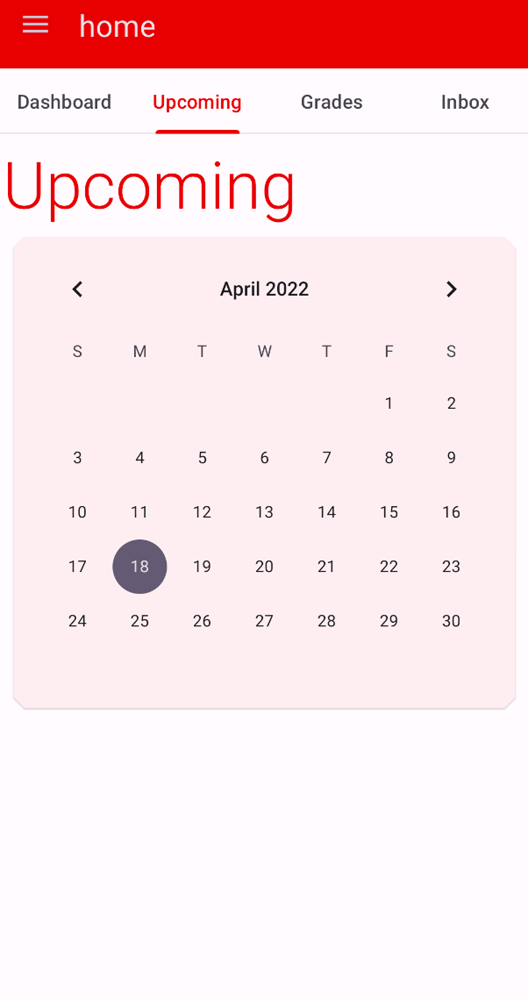

#### Grades
Here is where the student can calculate their Semester and Year GPA based on the courses they add on their dashboard. Users can also choose to calculate hypothetical GPA and provide random courses. 

  
  

  
  
#### Inbox

  Users communicate directly with the undergrad CS department instead the traditional email configuration. This was made to increase efficiency with the advising process so they can understand themselves. The advisor can also choose to send an important announcent to far off lands withough putting in Cardio.
  

  

                                 
 ## Part 2: Advising Resources

  Same navigation as part 1, but on each screen we give the user a different type of information (dept overview, course list, degree requirements are all in different swipeable tabs). This part of the app is all about referencing information.
 #### Department Overview
 

  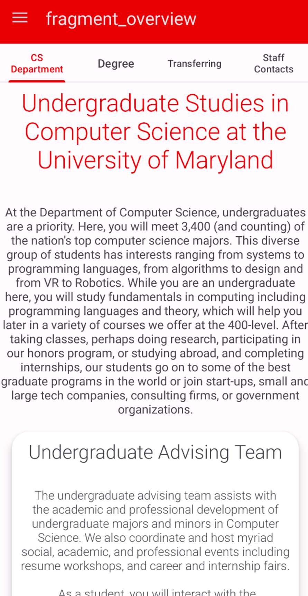
  

  
  #### Degree
   

  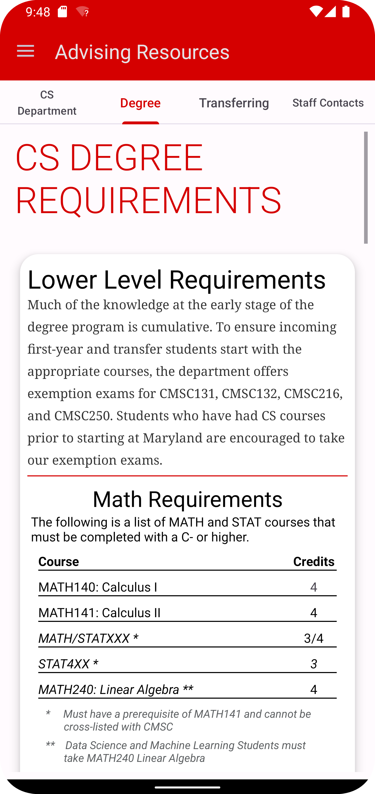
  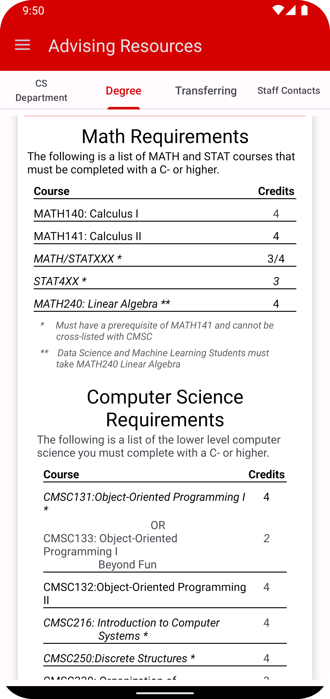  
  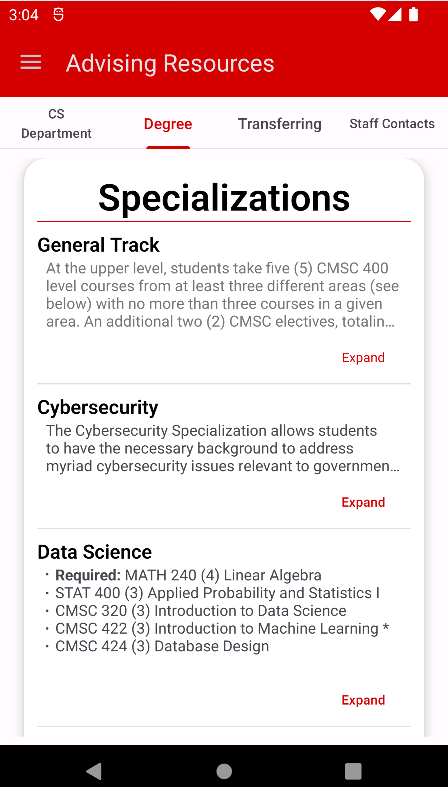

  
  #### Transfer Student Info 
 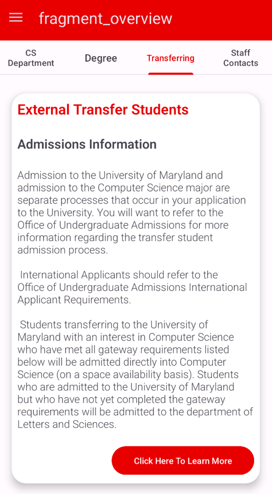

  
  #### Contacting Advisors (unfinished)
 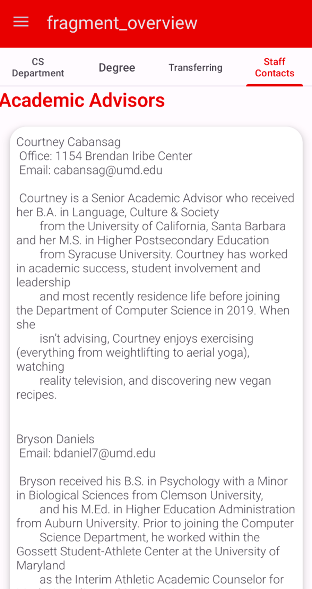

 
 ## Part 3: CMSC 300 level - 400 level course permission form
 All students that want to take a 3XX or 4XX CMSC course bust obtain permission from their advisors and this is currently done via email communication and google forms. This feature allows students to fill the form out in the app with access to the course information that they find in testudo under the Course Information tab. 
 
 ##### The following three images are just one screen, the form is in a scrollview. 
  

  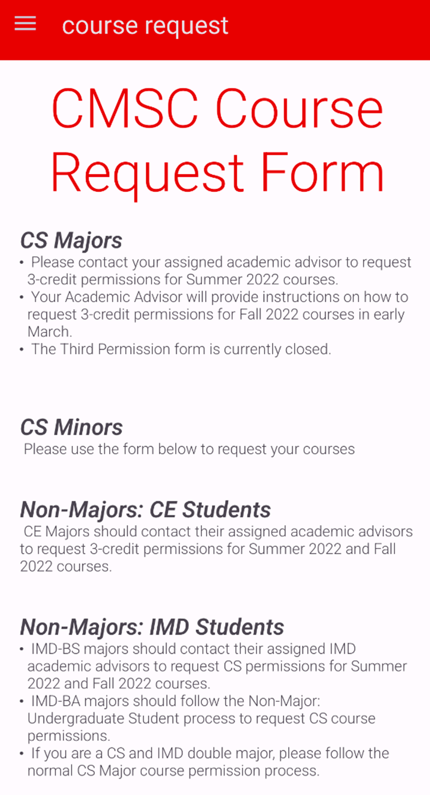
    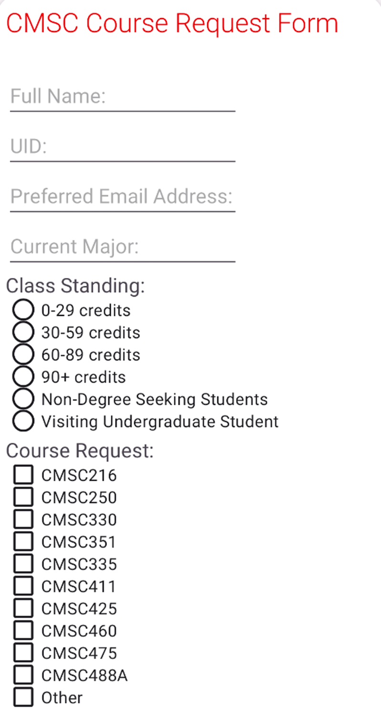  
  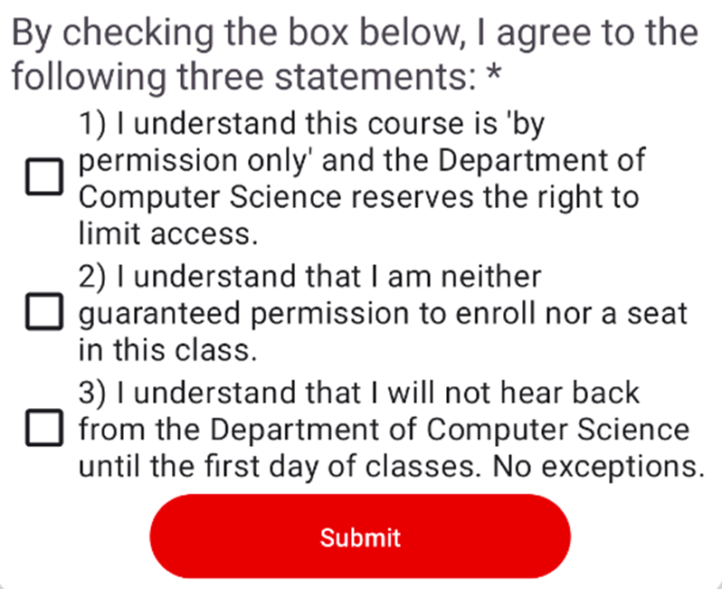
  

  
  ## Part 4. Course Information (unfinished)
Shows all courses being offered and their data.

  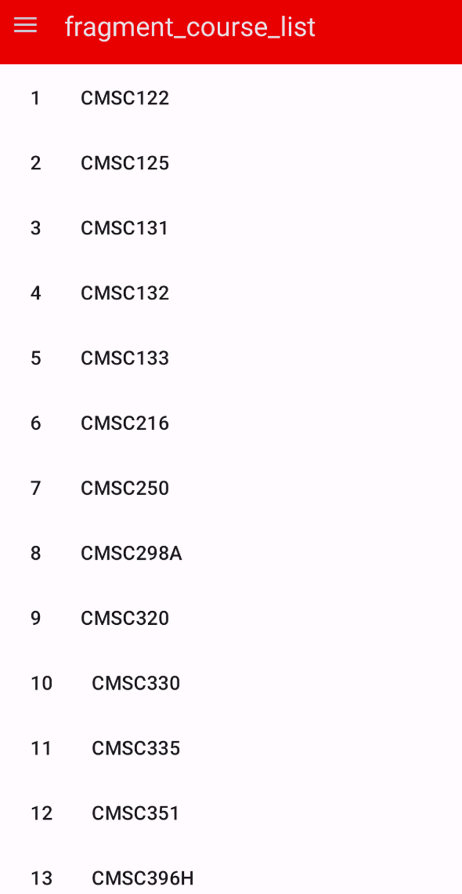
  

 
 
 # TODO: 
 - fix the formatting of two screens and fetch data from umd.io
